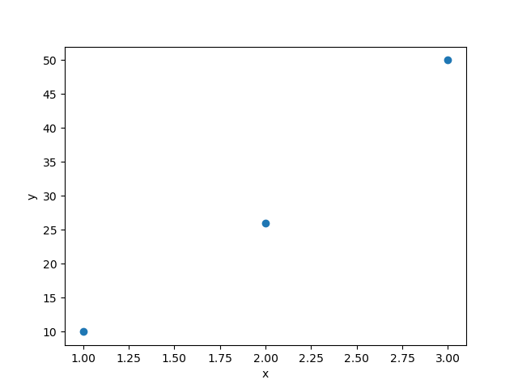
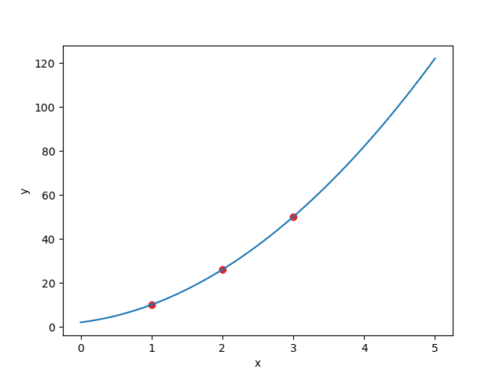

# _Python for Scientific Data Analysis_

# NumPy/SciPy

## Section 5: Basic Linear Algebra with NumPy and SciPy

Linear Algebra is a cornerstone of computational mathematics.   The simple linear algebra you probably learned in high school or undergrad consists of small vectors and matrices.   But the real power with linear algebra rests in very large matrices and vectors.  Since you cannot realistically solve these by hand, computers come in.  Hence, the importance of numerical linear algebra.

Both NumPy and SciPy have numerous linear algebra routines.  In this section, we will focus on the simplest ones with NumPy, describing how to do basic linear algebra operations.    

Later in the course, after we have learned _Matplotlib_, _Pandas_, and _AstroPy_ , we will build upon this foundation to describe more advanced linear algebra operations with both NumPy and SciPy and advanced modeling with SciPy.   But for now, this short introduction to linear algebra and modeling will allow us to do useful things with packages.


### Creating Vectors and Matrices with NumPy

Creating vectors and matrices for linear algebra operations is straightforward with NumPy.   In fact, you have done them already.  E.g. 

```
a_vector=np.array([1,2,3,4,5,6]) #orientless
#array([1, 2, 3, 4, 5, 6])
a_vector.shape
#(6,)

a_row_vector=np.array([[1,2,3,4,5,6]])
#array([[1, 2, 3, 4, 5, 6]])
a_row_vector.shape
#(1, 6)

a_column_vector=np.array([1],[2],[3],[4],[5],[6])
#array([[1],
       [2],
       [3],
       [4],
       [5],
       [6]])

a_column_vector.shape
#(6, 1)

a_matrix=np.array([[1,2,3],[4,5,6]])
a_matrix.shape
#(2,3)
```

Note that the first example -- _a\_vector_ -- is orientationless: it is neither a row nor column vector but just a 1D list of numbers in NumPy.  Orientation in NumPy is given by brackets ``[ ]``.  The outermost brackets group all of the numbers together into one object.   Then, each additional set of brackets indicates a row: so a row vector has all numbers in one row, while a column vector has multiple rows, with each row containing one number.   A matrix then will have multiple rows with each row containing more than one number.

Array arithmetic rules -- e.g. adding, subtracting -- follow those described in Section 2.

### Basic Linear Algebra Operations

#### _Vector Norms_

The magnitude or _norm_ of a vector is the distance from head to tail of the vector.  It is computed using the standard Euclidean distance formula: the square-root of the sum of squared vector elements:

||v||$_{2}$ = $\sqrt{\sum_{i=1}^{n} v_{i}^{2}}$

In Python this can be computed as 
``np.linalg.norm(v)``. 

 Note, since technically this is the $L_{\rm 2}$ norm the `v` has that subscript of `2`.  There are other norms -- the $L_{\rm 1}$ ("Manhattan" norm) which is ||v||$_{1}$ = $\sum_{i=1}^{n} |v_{i}|$ (i.e. the sum of the absolute value of array elements), etc. -- but you can read up on those if you want in case you don't already know them.   

Here's an example of computing the vector norm with NumPy:

```
import numpy as np
a=np.array([[3,4,5,6,7]])

np.linalg.norm(a)
#11.61895003862225

np.linalg.norm(a,2) #note: same thing ... you are asking NumPy to compute the L2 norm
#11.61895003862225

np.linalg.norm(a,1) #note: different! ... you are asking NumPy to compute the L1 or 'Manhattan' norm
#7.0
```

Note the full capability of ``norm`` is complex and best left for official documentation, which is here:[https://numpy.org/doc/stable/reference/generated/numpy.linalg.norm.html]()


Sometimes we don't want the vector as-is but want a corresponding _unit vector_, where ||v|| = 1.   To produce this unit vector you have to take the input vector and divide by its norm. 


#### _Matrix Determinant_

The _determinant_ is a key property associated with a square matrix.   It has a special importance when we later get to inverting matrices or do eigendecomposition of them.   The determinant of matrix $A$ is usually noted as $det(A)$ or |A|.  

As you might remember, it's pretty easy to calculate determinants for small matrices, e.g. 2x2:

$\left[ {\begin{array}{cc}
   a & b \\
   c & d \\
  \end{array} } \right]$ 
  = $ad-bc$
  
For much larger matrices this gets quickly unwieldy, although you may remember how to use cofactor expansion to compute the determinants of slightly larger matrices:


$\left[ {\begin{array}{cc}
   1 & 2  & 3\\
   4 & 5  & 6\\
   7 & 8 & 9
  \end{array} } \right]$ 
  = 1$\left[ {\begin{array}{cc}
   5 & 6 \\
   8 & 9 \\
  \end{array} } \right]$ - 2$\left[ {\begin{array}{cc}
   4 & 6 \\
   7 & 9 \\
  \end{array} } \right]$ + 3$\left[ {\begin{array}{cc}
   4 & 5 \\
   7 & 8 \\
  \end{array} } \right]$ = -3 +12 - 9 = 0


Thankfully, we can just ask NumPy:

``matrix_det=np.linalg.det([matrix])``.

Or SciPy

``from scipy import linalg; matrix_det=linalg.det([matrix])``.

e.g.

```
import numpy as np
from scipy import linalg

a=np.array([[1,2,3],[4,5,6],[7,8,9]])
a.shape #3x3 matrix

matrix_det=np.linalg.det(a)
#0
matrix_det=linalg.det(a)
#0
```


### Vector and Matrix Multiplication

The real power with NumPy's linear algebra routines come from multiplying large matrices and vectors, which we obviously cannot do by hand.   Routines for how to do this are below ...

#### _Dot Product_

The ``dot`` operation does vector-vector, matrix-vector, and matrix-matrix multiplication of two arrays: ``np.dot([first array],[second array])``. E.g. ``np.dot(a,b)``.

Mathematically, what this operation does for each is:

The vector-vector operation for each element $i$, resulting in scalar $s$ from vectors $x$ and $y$:

 $s = \sum_{i} x_{i} y_{i}$
 
 The matrix-vector operation, for each $i$ row and $j$ column, resulting in vector $y$ from matrix $A$ and vector $x$:

 $y_{i} = \sum_{j} A_{ij} x_{j}$
 
 
  The vector-matrix operation, for each $i$ row and $j$ column, resulting in vector $y$ from matrix $A$ and vector $x$:

 $y_{j} = \sum_{i}  x_{i} A_{ij}$
 
 
 The matrix-matrix operation, resulting in matrix $C$ from matrices $A$ and $B$:
 
 $C_{ij} = \sum_{k} A_{ik} B_{kj}$


Again, in all cases, the operation is ``np.dot([first array],[second array])``

 Note, it is quite easy to get broadcasting errors when doing matrix-vector or vector-matrix operations, so here are examples of how this works:
 
 ```
 import numpy as np
 
 a=np.array([[1,2],[3,4]]) #2x2 matrix 1, 2 for row =0 and 3,4 for row =1
 b=np.array([[1,2]]) #a row vector
 b2=np.array([[1],[2]]) #a column vector
 
 #np.dot(a,b) #can't do this
 np.dot(a,b2) #matrix-vector multiplication
 #([[5],[11]]) #column vector
 
 np.dot(b2,a) #can't do this
 np.dot(b,a)  #vector-matrix multiplication
 #([[ 7, 10]]) #row vector
 ```

#### _Np.Matmul_

NumPy provides another, simpler routine for _matrix_ multiplication, called (unsurprisingly) ``np.matmul([first matrix,second matrix])``.  

E.g. in our previous example of matrices $A$ and $B$ this matrix multiplicaiton results in matrix $C$:
 
 $C_{ij} = \sum_{k} A_{ik} B_{kj}$
 
 For this case, the call is ``np.matmul(A,B)``.
 
 Now, there will be plenty of other matrix operations of greater sophistication and power.  But we will get to these later.
 

#### _Outer Product_
 
 Here's another useful operation: the _outer product_.   The outer product of two vectors creates a matrix.  In order to make this work, one vector must be a column vector and another must be a row vector.
 
 e.g. 

  $\left[ {\begin{array}{cc}
   a \\ b \\
   c \\ 
  \end{array} } \right]$   $\left[ {\begin{array}{cc}
   d & e \\
  \end{array} } \right]$ 
  = $\left[ {\begin{array}{cc}
   ad & ae \\
   bd & be \\
   cd & ce \\
  \end{array} } \right]$ 
  
  In code, the outer product is computed as ``np.outer(a,b)``.   Below is an example:
  
 ```
 v1=np.array([[1,2,3,4]])
 #array([[1, 2, 3, 4]])
 
 v2=np.array([[5],[6],[7]])*0.5
 #array([[2.5],
 #      [3. ],
 #      [3.5]])
 
 mat1=np.outer(v1,v2)
 #array([[ 2.5,  3. ,  3.5],
 #      [ 5. ,  6. ,  7. ],
 #      [ 7.5,  9. , 10.5],
 #      [10. , 12. , 14. ]])
 
 ```
 
 Note also, the ``np.dot`` function can _also_ compute an outer product PROVIDED that the first vector is a column vector and second is a row vector. 
 
 e.g. 
 
 ```
 b=np.array([[11,27]]) #a row vector
 b2=np.array([[13],[32]]) #a column vector
 
 result=np.dot(b2,b)
 
  #array([[143, 351],
       [352, 864]]) 
 
 result2=np.outer(b2,b)
 
 #array([[143, 351],
       [352, 864]])
 ```
 
### Solving Basic Linear Equations

Now, we can take the power of numerical linear algebra to the next level by using it to solve systems of linear equations.   **_Many_** coding problems I  encounter are really just dressed up versions of a simple task to solve linear equations.  

For instance, consider the following set of linear equations:

$x_{\rm 1} + 4x_{\rm 2} = 1\\
3x_{\rm 1} + 4x_{\rm 2} = -4$

Now, you could just solve this by hand fairly fast ($x_{\rm 1} = -2.5$, $ x_{\rm 2} = 0.875$). But why do that when NumPy and SciPy will solve it for you & do it faster?

Recast the system of linear equations as a matrix equation of the form $\textbf{Ax}$ = $\textbf{b}$.  Here, $\textbf{A}$ equals the coefficients in front of the variables: $\left[ {\begin{array}{cc}
   1 & 4 \\
   3 & 4 \\
  \end{array} } \right]$ .   And $\textbf{b}$ equals the right-hand side of the equation: a column vector: $\left[ {\begin{array}{cc}
   1 \\
  -4
  \end{array} } \right]$.   The unknown $\textbf{x}$ equals the two variables $x_{\rm 1}$ and $x_{\rm 2}$.   
  
  In Python this is written as:
  
  ```
  a=np.array([[1,4,],[3,4]]) #a two-by-two matrix
  b=np.array([[1],[-4]]) #a column matrix
  ```
  
  We can then solve this system of linear equations by matrix _inversion_.  Thankfully, NumPy and SciPy have a LOT of tools to do this in various ways.  For now, we will focus on the most obvious, brute-force way: a simple inversion:
  
  $\textbf{x}$=$\textbf{A}^{-1} \textbf{b}$
  
  Here are various ways to solve it in NumPy:
  
  ``np.linalg.solve``
  
  ```
  a=np.array([[1,4,],[3,4]]) #a two-by-two matrix
  b=np.array([[1],[-4]]) #a column matrix

  x=np.linalg.solve(a,b)
  #array([[-2.5  ],
       [ 0.875]])
  ```
  
  Using ``np.linalg.inv`` (the inversion function) and ``np.dot``
  
  ```
  a=np.array([[1,4,],[3,4]]) #a two-by-two matrix
  b=np.array([[1],[-4]]) #a column matrix
  
  np.linalg.inv(a).dot(b)
  #array([[-2.5  ],
       [ 0.875]])
  ```
  
  
  Using SciPy's``linalg.solve``
  
  ```
  from scipy import linalg
  linalg.solve(a,b)
  #array([[-2.5  ],
       [ 0.875]])
  ```
  
  Using SciPy's ``linalg.inv`` and ``np.dot``
  
  ```
  from scipy import linalg
  a=np.array([[1,4,],[3,4]]) #a two-by-two matrix
  b=np.array([[1],[-4]]) #a column matrix
  
  linalg.inv(a).dot(b)
  #array([[-2.5  ],
       [ 0.875]])
  
  ```
  
### Simple Example: Curve Fitting

You can use treat curve fitting as a set of linear equations to solve and thus use matrix inversions to determine a functional fit to the data.  

Here's a super-simple example



Here we have three data points, where x = [1,2,3] and y = [10,26,50].   You might think (rightly) that this can be fit by a quadratic equation, or $y$ = $a_{o}$ + $a_{1}$x+$a_{2}$x$^{2}$.

So ... what do we know?
when x = 1, then we have 10 = $a_{o}$ + $a_{1}$ + $a_{2}$.
when x = 2, then we hae 26 = $a_{o}$ + 2$a_{1}$ + 4$a_{2}$.
when x = 3, then we hae 50 = $a_{o}$ + 3$a_{1}$ + 9$a_{2}$.

Or ...

$a_{o}$ + $a_{1}$ + $a_{2}$ = 10

$a_{o}$ + 2$a_{1}$ + 4$a_{2}$ = 26

$a_{o}$ + 3$a_{1}$ + 9$a_{2}$ = 50

I.e. a system of linear equations we can solve.  First, we can verify that we do have a unique solution:

``np.linalg.det(A)`` equals ``2.0``.

Now, solve:


```
b = np.array([10, 26, 50]).reshape((3, 1)) #convert b to a column vector
coeff= np.linalg.inv(A).dot(b) #matrix-vector multiplication 

coeff
#array([[2.],
       [4.],
       [4.]])

``` 

This result tells you that $a_{0}$ = 2, $a_{1}$ = 4, and $a_{2}$ = 4 is a solution, which is confirmed by comparing the data to the model:



(Note: in this case, it is not a *unique* solution since the determinant of A, as we find now that we have coefficients, is zero ... but small details ...).

### More Complex Example: LOCI
