## Section 8: Principal Component Analysis with NumPy and SciPy

### Principal Component Analysis

#### What is PCA?
If you do a Google search, you'll find a lot of definitions for principle component analysis.  

* "An unsupervised learning technique" (a "machine learning aficionado's definition"; well true, but not relevant yet).  

* "[A] dimensionality reduction method that is often used to reduce the dimensionality of large data sets, by transforming a large set of variables into a smaller one that still contains most of the information in the large set" (Yes, but it does more than just make your life easier).

* "[A] statistical procedure that allows you to summarize the information content in large data" (yes, but vague?)

In truth, PCA is all these things.  I would define PCA in terms of its literal mathematical formation and its practical consequence:

* "PCA finds an orthonormal basis for the k-dimensional subspace (k $\le$ K) in a matrix of full-rank K that maximizes the sum-of-squares
of the projected data [represented in said matrix]. " (a riff on the definition given by Dr. Jonathan Pillow, statistician at Princeton)

* ... " that allows you to identify patterns/correlations that explain said data and compare their importance". In other words, the principal components are a mathematical way of describing the correlations that we see in data with a high number of dimensions/features.  

 If you have some data and only have, say, one attribute that is varied (i.e. the data are a function only of one variable) then modeling the data should be pretty straightforward.  But what about if you have 3 attributes?  Or 30? Or 3,000?   And they are all acting on the same data set.  PCA allows you to sift through these, identify the ones that explain the data the most, second most, third most, etc.
 
 ---

So anyway the first part of the definition is basically saying PCA is a geometrical transformation to a more useful "coordinate" system (blahblahblah finding an orthonormal basis).  We introduced this concept in the previous section on eigendecomposition.

This is a key point but what do we really mean by that?   Here's a demonstration.   

```
import numpy as np
import matplotlib.pyplot as plt
plt.style.use('seaborn-whitegrid')

rng = np.random.RandomState(1)
X = np.dot(rng.rand(2, 2), rng.randn(2, 200)).T
plt.xlabel('X val')
plt.ylabel('Y val')
plt.scatter(X[:, 0], X[:, 1])
plt.axis('equal')
```


By eye, it is clear that there is a nearly linear relationship between the x and y variables.   You imagine a linear equation y = mx+b plus some noise being reproduced here.  

That's great, but there's actually more information here and we can find it if we do a coordinate transformation.  Instead of having x and y coordinates, we have "fake x" and "fake y" coordinates, which we gain from a rotation of axes.   When we do so, we align the dominant trend along one axis and the "residuals" along the other.   We will learn later how to do this ("construct principal components") manually, but for now let's "cheat" by using ``scikit-learn"'s module that does all the work for us.

```
from sklearn.decomposition import PCA
pca = PCA(n_components=2)
pca.fit(X)
```

The fit learns some quantities from the data, most importantly the components and explained variance:

```
print(pca.explained_variance_)
[0.7625315 0.0184779]

```

To see what these numbers mean, let's visualize them as vectors over the input data, using the components to define the direction of the vector and the explained variance to define the squared length of the vector (see the following figure):

```
def draw_vector(v0, v1, ax=None):
    ax = ax or plt.gca()
    arrowprops=dict(arrowstyle='->', linewidth=2,
                    shrinkA=0, shrinkB=0)
    ax.annotate('', v1, v0, arrowprops=arrowprops)

# plot data
plt.scatter(X[:, 0], X[:, 1], alpha=0.2)
for length, vector in zip(pca.explained_variance_, pca.components_):
    v = vector * 3 * np.sqrt(length)
    draw_vector(pca.mean_, pca.mean_ + v)
plt.axis('equal')
plt.show()
```

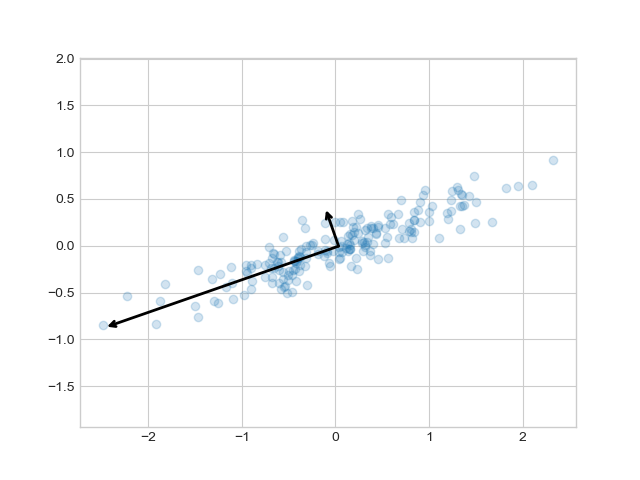

These vectors represent the principal axes of the data, and the length of each vector is an indication of how "important" that axis is in describing the distribution of the data—more precisely, it is a measure of the variance of the data when projected onto that axis. So the longer arrow is the most important vector; the shorter one is second in importance.  The projection of each data point onto the principal axes are the _principal components_ of the data.

If we plot these principal components beside the original data, we see the plots shown in the following figure:

```
def draw_vector(v0, v1, ax=None):
    ax = ax or plt.gca()
    arrowprops=dict(arrowstyle='->',
                    linewidth=2,
                    shrinkA=0, shrinkB=0)
    ax.annotate('', v1, v0, arrowprops=arrowprops)

rng = np.random.RandomState(1)
X = np.dot(rng.rand(2, 2), rng.randn(2, 200)).T
pca = PCA(n_components=2, whiten=True)
pca.fit(X)

fig, ax = plt.subplots(1, 2, figsize=(16, 6))
fig.subplots_adjust(left=0.0625, right=0.95, wspace=0.1)

# plot data
ax[0].scatter(X[:, 0], X[:, 1], alpha=0.2)
for length, vector in zip(pca.explained_variance_, pca.components_):
    v = vector * 3 * np.sqrt(length)
    draw_vector(pca.mean_, pca.mean_ + v, ax=ax[0])
ax[0].axis('equal');
ax[0].set(xlabel='x', ylabel='y', title='input')

# plot principal components
X_pca = pca.transform(X)
ax[1].scatter(X_pca[:, 0], X_pca[:, 1], alpha=0.2)
draw_vector([0, 0], [0, 3], ax=ax[1])
draw_vector([0, 0], [3, 0], ax=ax[1])
ax[1].axis('equal')
ax[1].set(xlabel='component 1', ylabel='component 2',
          title='principal components',
          xlim=(-5, 5), ylim=(-3, 3.1))

plt.show()
```
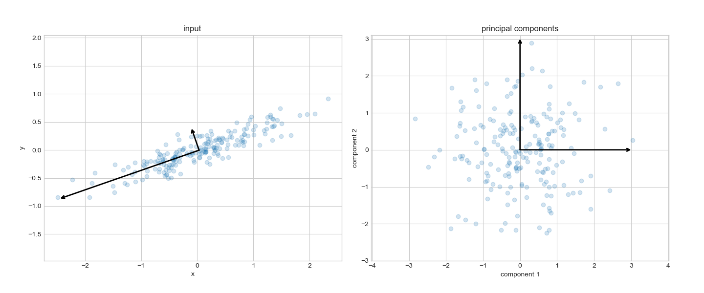

#### PCA as Dimensionality Reduction

Using PCA for dimensionality reduction involves zeroing out one or more of the smallest principal components, resulting in a lower-dimensional projection of the data that preserves the maximal data variance. (or colloquially and crudely "getting rid of **** that isn't important" to focus on what is).

Here is an example of using PCA as a dimensionality reduction transform:

```
pca = PCA(n_components=1)
pca.fit(X)
X_pca = pca.transform(X)

print("original shape:   ", X.shape)
#original shape:    (200, 2)

print("transformed shape:", X_pca.shape)
transformed shape:    (200, 1)
```

The transformed data has been reduced to a single dimension. To understand the effect of this dimensionality reduction, we can perform the inverse transform of this reduced data and plot it along with the original data 

```
X_new = pca.inverse_transform(X_pca)
plt.scatter(X[:, 0], X[:, 1], alpha=0.2)
plt.scatter(X_new[:, 0], X_new[:, 1], alpha=0.8)
plt.axis('equal');
```

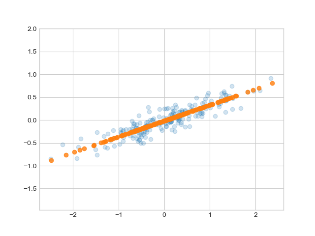

The light points are the original data, while the dark points are the projected version. This makes clear what a PCA dimensionality reduction means: the information along the least important principal axis or axes is removed, leaving only the component(s) of the data with the highest variance. The fraction of variance that is cut out (proportional to the spread of points about the line formed in the preceding figure) is roughly a measure of how much "information" is discarded in this reduction of dimensionality.

This reduced-dimension dataset is in some senses "good enough" to encode the most important relationships between the points: despite reducing the number of data features by 50%, the overall relationships between the data points are mostly preserved.


#### "Doing" Principal Component Analysis 

In the preceding example, we cheated a bit by using the SciKit-Learn implementation of PCA, which basically just has you press a button and get "PCA" in return.  That doesn't tell you how you actually perform this analysis in the first place.  Now, we will do PCA from scratch, so you understand what is in the black box.

There are several steps to doing PCA.

1 -- **Mean-Center the Data (Matrix)**, $\bar{M}$ = $M$ - mean($M$).   This means subtract the mean value of the data along each original dimension.   The dataset should be "centered" on the origin.  E.g. ``data_mat_meansubbed = data_mat-np.mean(data_mat,axis=0)``.  

2 -- **Compute the Covariance Matrix**.  The covariance matrix of a matrix with dimensions $m$x$n$ is that matrix multiplied by its transpose $a a^{T}$.     NumPy has a built-in function to do this: ``np.cov``, though I usually do mine with ``np.matmul``, where one matrix is the input matrix and another is its transpose.  E.g. ``cov=np.matmul(data_mat_meansubbed.T,data_mat_meansubbed)`` or ``cov=np.cov(data_mat_meansubbed,rowvar=False)``.  Be wary of the units: the documentation for ``np.cov`` gives a good guide for what the _intent_ of this calculation is all about.  E.g. for a set of images, the rows and columns correspond to image number (in the sequence) and pixel coordinates.  If you have 50 images and 100 pixels then your covariance matrix should be a square matrix of 50x50.

3 -- **Eigen-decompose the covariance matrix** to yield the eigenvectors and eigenvalues.  This is done (in NumPy) as ``np.linalg.eigh([name of covariance matrix])``.   E.g. ``eig_val, eig_vec = np.linalg.eigh(cov)``.

 Note that other people use ``np.linalg.eig``, which is fine for non-square matrices.  But this decomposition only works with square matrices and ``eig`` doesn't rank-order the eigenvalues/vectors by contribution.  Which brings us to ...
 
4 -- **Sort the Eigenvalues and Eigenvectors from largest to smallest**.  If you use ``np.linalg.eigh``, the easiest way to do this is something like the following:

```
indices = np.argsort(eig_val)[::-1]
eig_val = eig_val[indices]
eig_vec = eig_vec[:,indices]
```

5 -- **Select Number of Principal Components to Retain, Compute Principal Components** .  First, select the number of PCs to retain.   Let's say you have a covariance matrix that is 50x50.   You can model the data by up to 50 principal components.  To choose the first 5 principal components to explain the data, you then slice on the eigenvector and eigenvalue variables.  E.g. for retaining _npca_ principal components, you perform something like the following:

``eig_vec=eig_vec[:,:npca]`` and ``eig_val=eig_val[:npca]``.  

Then finally you multiply the original mean-subtracted matrix by the eigenvectors: i.e. $PC$ = $\textbf{M}$$\textbf{V}$.

In Python this operation looks like the following:

``pca_data = data_mat_meansubbed.dot(eig_vec)``.   

And that's it!

... except one more optional step.

6 -- **Reconstructing the Data with PCA** -- If you then want to reconstruct the data itself to see how well PCA reproduces the data, you simply take the _inverse_ transform and add the original data mean to recover the _approximated_ (or modeled or estimated ... whatever term you want) data that is _reconstructed_ from principal components.  

E.g. ``data_mat_est = pca_data.dot(eig_vec.T)+np.mean(data_mat,axis=0)``

---
To demonstrate PCA from scratch, we are going to create a mock 10-D data set.   The data set consists of 1000 random draws from a gaussian distribution with a mean value of 3 $\pm$ a randomly chosen number along each dimension.  The width of the gaussian is varied along each dimension, made especially big along the first two dimensions.  We introduce a non-zero _covariance_ in the width ($\sigma$) along different dimensions so our data doesn't nicely separate along x,y,z ...10-d to begin with.   

The source code is found in ``pcademo3.py`` under the function aptly named ``runme``.  We repeat the key lines for the first part of this program before we get to really analyzing our results.

```
def runme(npca=5,plotrelpc=True,plotorigvspc=True):

#####Setting Up
 ndim = 10
 mu = np.array([3]+np.random.rand(ndim)) # Mean
 sigma=np.full((ndim,ndim),5+np.random.rand(ndim*ndim).reshape(ndim,ndim))

#some trickery to adjust the relative PCs to an interesting range of values
 sigarr=5+np.arange(0,ndim)*0.5
 sigarr[0:2]=np.array([15,7.5])
 np.fill_diagonal(sigma,sigarr)

# print("Mu ", mu.shape)
# print("Sigma ", sigma.shape)

 # Create 1000 samples using mean and sigma
 org_data = rnd.multivariate_normal(mu, sigma, size=(1000))
 print("Data shape ", org_data.shape)


##### Step 1 -  Subtract mean from data
 mean = np.mean(org_data, axis= 0)
# print("Mean ", mean.shape)

 mean_data = org_data - mean
# print("Data after subtracting mean ", org_data.shape, "\n")

#### Step 2 - Computing the Covariance Matrix
 cov=np.matmul(mean_data.T,mean_data)

 #print("Covariance matrix ", cov.shape, "\n")

#### Step 3 - Eigendecomposition
 eig_val, eig_vec = np.linalg.eigh(cov)

# print("Eigen vectors ", eig_vec.shape)
# print("Eigen values ", eig_val.shape, "\n")


#### Step 4 - Sort the Eigenvalues and Eigenvectors, large to small
 indices = np.argsort(eig_val)[::-1]

 eig_val = eig_val[indices]
 eig_vec = eig_vec[:,indices]


 # Get explained variance
 sum_eig_val = np.sum(eig_val)
 explained_variance = eig_val/ sum_eig_val

 print("Explained variance ", explained_variance)
 cumulative_variance = np.cumsum(explained_variance)
 print("Cumulative variance ", cumulative_variance)

###Analysis
 if plotrelpc:
  # Plot explained variance
  plt.plot(np.arange(0, len(explained_variance), 1), cumulative_variance,marker='o')
  plt.title("Explained variance vs number of components")
  plt.xlabel("Number of components")
  plt.ylabel("Explained variance")
  plt.show()
  
  
  #### Step 5a - Select number of PCs to compute ...
   ## We will retain npca components
 n_comp = npca
 eig_vec = eig_vec[:,:n_comp]
 eig_val=eig_val[:n_comp]
 
 
 #### Step 5b - Compute the PCs
  # Take transpose of eigen vectors with data --> get PCs
 pca_data = mean_data.dot(eig_vec)

```

Go ahead and run this program with the full number of PCs 
``from pcademo2g import runme; runme(plotorigvspc=True,plotrelpc=True,npca=2)``

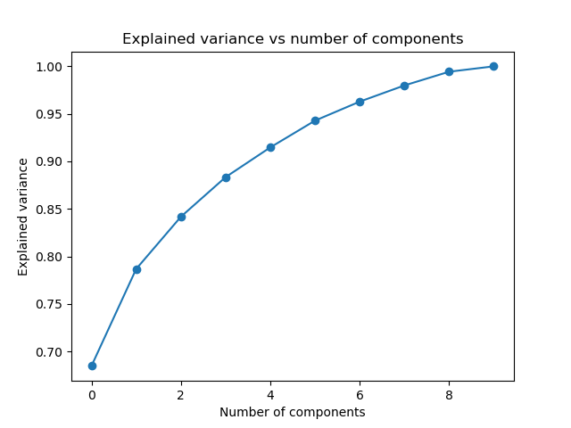

And focus on the first plot shown (above).  This is simply a plot of the "explained variance" as a function of PC.   Basically, how much variance is contained in each principal component?   From this plot, we see that a single principal component contains about 70% of the total variance in the entire data set.   The 2nd one contains abuot 10%, the third 5%, and so on.   The cumulative variance seems to approach a horizontal line as we approach 10 principal components.   

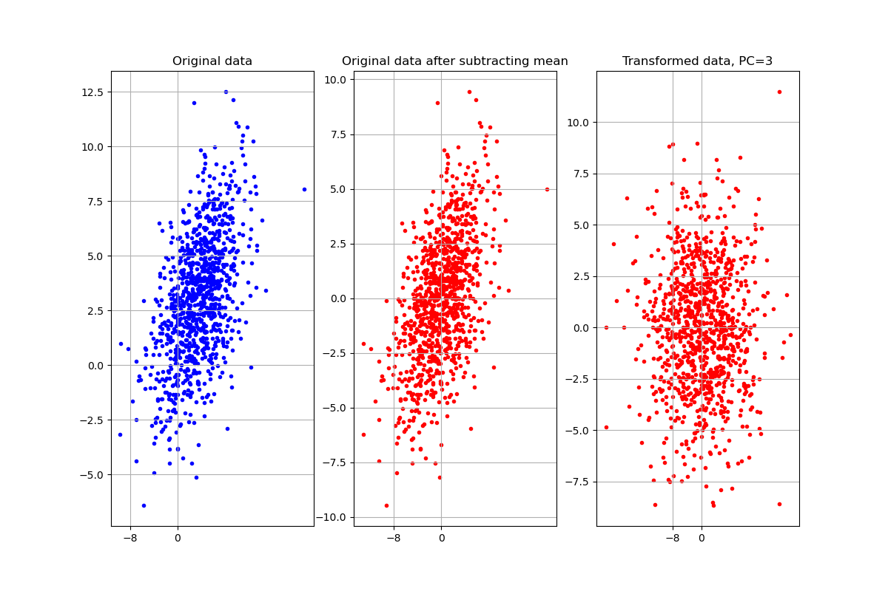

Now look at the next plot above comparing the original data along the first two dimensions, the mean-subtracted data, and the "transformed" data (i.e. transformed to a new basis ... the PC basis consisting of 3 principal components).  The slope in the original data?   It's gone in the PC plot: we just see some dispersion perfectly along the two PC axes.

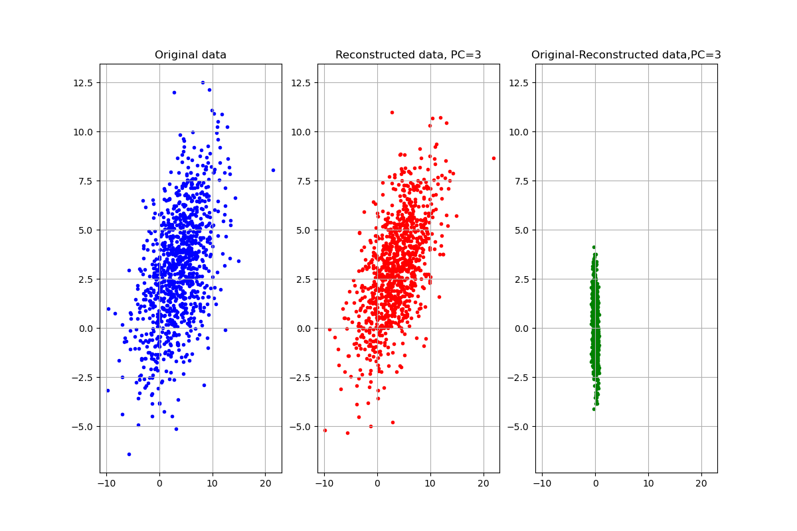

Finally, this plot.   Compare the blue vs red trend and then the residuals (in green).  The reconstructed data are a pretty good representation except that the y axis is elongated and there's an ever-so-slight tilt in the residuals going left to right.   Now, let's gradually bring up the number of PCs removed.

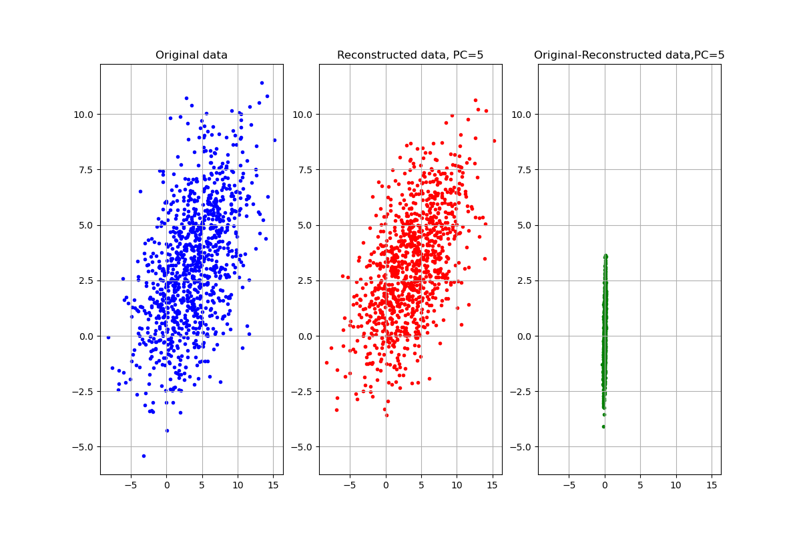

``runme(plotorigvspc=True,plotrelpc=True,npca=5)`` (5 PCs)

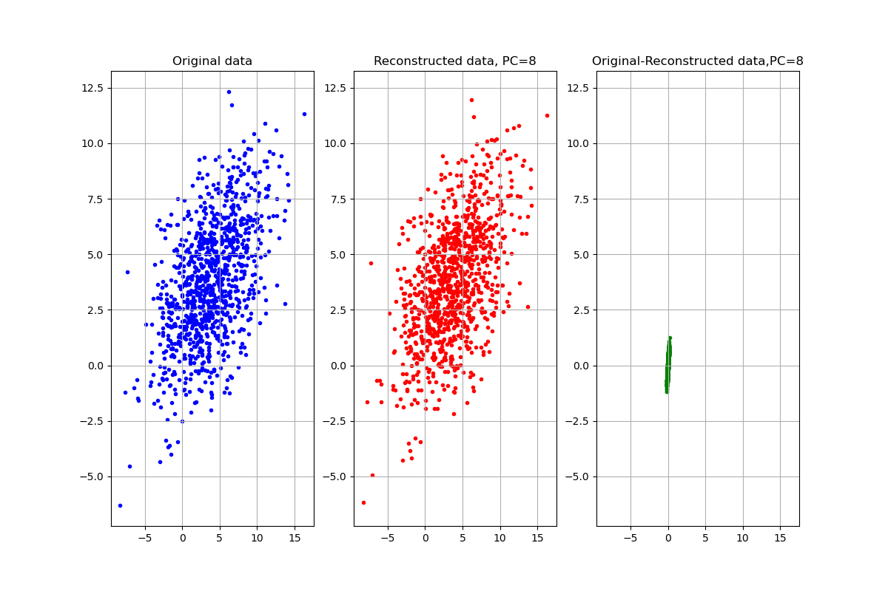

``runme(plotorigvspc=True,plotrelpc=True,npca=5)`` (7 PCs)

If we run this with 10 principal components retained we fully recover the original data.

---

Okay, great but if we can just model the data perfectly by retaining all PCs, why do we ever want to truncate the PC basis for anything?   Well, the answer rests largely in applications of PCA.  What if instead of the contrived model I made, the data are instead "noisy" (and they are ALWAYS noisy)?   E.g. if we have a bunch of images, 

#### Applications of PCA

There are a ton of applications to PCA.  I will focus on just a few of them here.

1 -- **Face Recognition** 

PCA can be used as a sort of engine to do face recognition (this may be covered later under machine learning ... time permitting).  For now, we will simply demonstrate its ability to extract key properties of people's faces that, "by eye", are good enough for identification.   We will use the Labeled Faces in the Wild dataset, which consists of several thousand collated photos of various public figures. A fetcher for the dataset is built into Scikit-Learn:Each image contains [62×47] or nearly 3,000 pixels.

The source code for this exercise is in ``eigenfaces.py``.

Let's take a look at the principal axes that span this dataset. Because this is a large dataset, we will use Randomized PCA in scikit-learn —it contains a randomized method to approximate the first principal components much more quickly than the standard PCA estimator, and thus is very useful for high-dimensional data (here, a dimensionality of nearly 3,000 ... that's a lot!). We will take a look at the first 150 components:

```
from sklearn.decomposition import RandomizedPCA
pca = RandomizedPCA(150)
pca.fit(faces.data)

```

In this case, it can be interesting to visualize the images associated with the first several principal components (these types of images are often called "eigenfaces"):

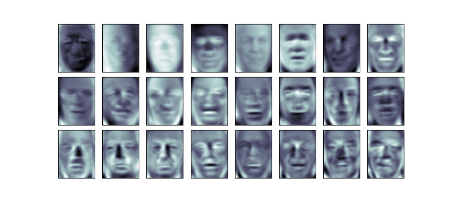


The results give us insight into how the images vary: for example, the first few eigenfaces (from the top left) seem to be associated with the angle of lighting on the face, and later principal vectors seem to be picking out certain features, such as eyes, noses, and lips. 

Let's take a look at the cumulative variance of these components to see how much of the data information the projection is preserving:

```
plt.plot(np.cumsum(pca.explained_variance_ratio_))
plt.xlabel('number of components')
plt.ylabel('cumulative explained variance');
```

These 150 components account for about 90% of the variance. That would lead us to believe that using these 150 components, we would recover most of the essential characteristics of the data. To make this more concrete, we can compare the input images with the images reconstructed from these 150 components:

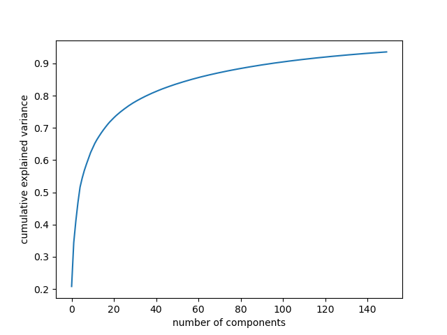


```
# Compute the components and projected faces
pca = RandomizedPCA(150).fit(faces.data)
components = pca.transform(faces.data)
projected = pca.inverse_transform(components)
```

```
# Plot the results
fig, ax = plt.subplots(2, 10, figsize=(10, 2.5),
                       subplot_kw={'xticks':[], 'yticks':[]},
                       gridspec_kw=dict(hspace=0.1, wspace=0.1))
for i in range(10):
    ax[0, i].imshow(faces.data[i].reshape(62, 47), cmap='binary_r')
    ax[1, i].imshow(projected[i].reshape(62, 47), cmap='binary_r')
    
ax[0, 0].set_ylabel('full-dim\ninput')
ax[1, 0].set_ylabel('150-dim\nreconstruction');
```
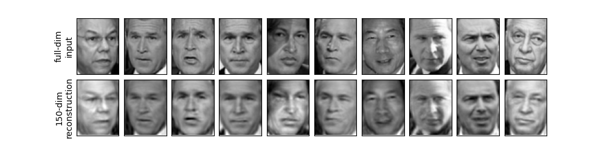

The top row here shows the input images, while the bottom row shows the reconstruction of the images from just 150 of the ~3,000 initial features.  Although it reduces the dimensionality of the data by nearly a factor of 20, the projected images contain enough information that we might, by eye, recognize the individuals in the image. What this means is that if we have a classification algorithm (Machine Learning jargon ... again, hopefully we cover this late), it needs to be trained on 150-dimensional data rather than 3,000-dimensional data, which depending on the particular algorithm we choose, can lead to a much more efficient classification.

Now, what about a more aggressive cutoff in PCs?  How about, say, 40 principal components?   Can we still recognize people then?

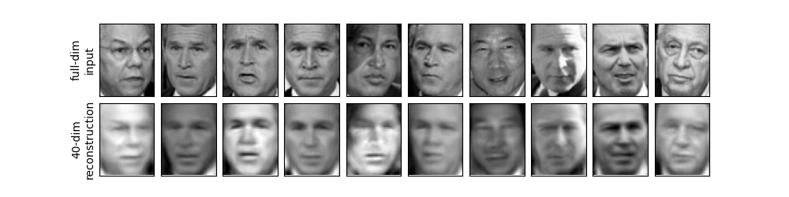

In some cases, yes.   

2 -- **Exoplanet Imaging** 

Okay, enough of the creepy faces.  There's another application of PCA that is particularly interesting.

Remember back a few lectures ago when we were solving least-squares problems and came up with the "Locally Optimized Combination of Images" algorithm?  That was a straight matrix inversion multiplied by a column vector to give you a set of coefficients useful for minimizing the noise in an image (and hopefully detecting a planet).  

What I didn't tell you then is that the **A** matrix in the **Ax** = **b** equation there is actually the covariance matrix.   We discussed earlier how we can truncate the covariance matrix using SVD to modify the LOCI algorithm.   Well, we can do a slightly different approach entirely: constructing a reference image to subtract from our target image where that reference consists of a linear combination of _eigenimages_.

Principal Component Analysis forms the backbone of this approach too.   What we do is that we take the basis set (jargon jargon basically the PCs) and _transform_ it again, dividing by the square root of the eigenvalues.  We call this new matrix $Z_{k}^{KL}$:

$Z_{k}^{KL}$ = $PC$/$\sqrt{\Lambda}$


 and then taking the dot product with a target image and multiplying the target image again.   It looks like this:

$<$($Z_{k}^{KL}$,$T$) $>$ $Z_{k}^{KL}$

(note: here in linear algebra hieroglyphics, the $<$ , $>$ means "dot product").  

So what is this?  Well, remember when we originally did data-eigenvector multiplication we can think of it as "transforming" the data to a new basis set?   Well this equation has its own special term: the _Karhunen-Loeve transform_.   The algorithm name is the _Karhunen-Loeve Image Projection_ algorithm or "KLIP" for short.

At full rank (i.e. you don't truncate anything), this is mathematically equivalent to LOCI. 

Below is an example image of an exoplanet with PCA/KLIP.

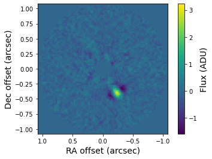 

