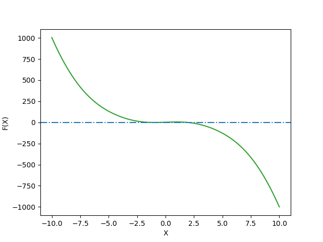
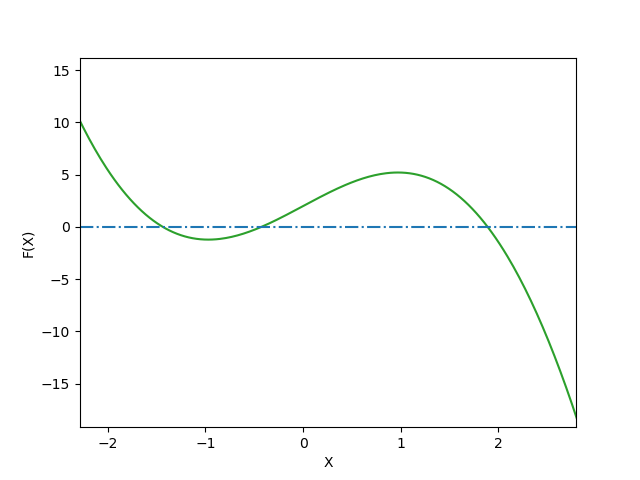
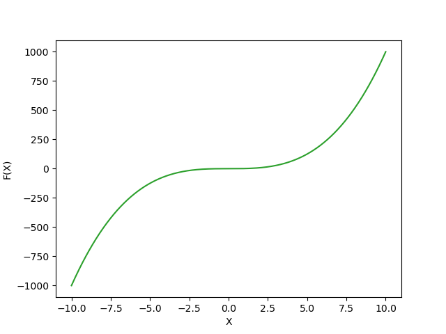

# _Python for Scientific Data Analysis_

# SciPy

## Section 6: Key Functions in SciPy

SciPy stands for Scientific Python.  SciPy is a scientific computation library that you will see referenced profusely in physics and astronomy coding applications.   SciPy SciPy contains modules for optimization, linear algebra, integration, interpolation, special functions, FFT, signal and image processing, ODE solvers and other tasks common in science and engineering.  

 Originally, it was written using its own data type (a "Numeric").  But then everyone realized that this wasn't a good idea.  So now the basic data structure used by SciPy is a multidimensional array provided by the NumPy module (i.e. it uses NumPy underneath).   

While a lot of the linear algebra operations in SciPy are also found in NumPy, SciPy is especially good for optimization, statistics, and signal processing/filtering of various flavors.

We have already discussed some of its linear algebra capabilities in the previous lectures, so we are going to switch gears slightly, first discussing its optimization capabilities.

### Optimization

The _optimization_ subpackage within Scipy can be accessed by ``from scipy import optimize``.   Nearly always you want to do array operations when setting up an optimization problem, in which case, you need to load NumPy as well.  So the typically preliminary steps for a SciPy optimization problem are to do the following at the beginning of your script:

```
import numpy as np
from scipy import optimize
```
#### 1. Root Finding

#### _Motivation_

  The root or zero of a function, $f(x)$, is an $x_{r}$ such that the function evaluated at $x_{r}$ equals 0 ($f(x_{r})$ =0).   
  
  Finding the roots of functions is important in many engineering applications such as signal processing and optimization. For simple functions such as $f(x) = ax^{2} + bx + c$, you can analytically solve for roots using the _quadratic formula_:
  
  $x_{r}$ = -b $\pm$ $\frac{\sqrt{b^{2}-4ac}}{2a}$ .  
  
  This gives the two roots of $f$, $x_{r}$, exactly.

But what about if you have a cubic function? Or quartic? Or just a very complicated-looking one?  In that case, you need to appeal to numerical methods to find roots.  

We will start of discussing root finding with ``scipy.optimize``'s ``fsolve`` function.   ``fsolve`` is pretty complicated and we are going to treat it as a black box for now.   

Then we will discuss an important topic with any sort of optimization procedure -- tolerancing -- before going back to describing a few the wide array of optimization approaches (e.g. gradient descent; Newton-Raphson) and what they actually do.   

#### _Basic Root Finding with SciPy.Optimize's ``fsolve``_

Our first stop in the process if doing this is the aptly named ``fsolve`` function within ``scipy.optimize``.  As the documentation states "_fsolve is a wrapper around MINPACK's hybrd and hybrj algorithms_."  Here, MINPACK is a FORTRAN subroutine library for solving minimization problems which you may have heard about.   So as with NumPy, SciPy does a lot of things that are basically friendly wrappers of algorithms in faster, simpler languages.

The actual algorithm used with ``fsolve`` is a version of _Powell's Hybrid Method_ which is a combination of the Gauss-Newton algorithm and gradient descent.  If you are really interested in the details of this method you can read about it here: [https://en.wikipedia.org/wiki/Powell's\_dog\_leg\_method]() .  If you are _really really_ interested (I'm not) you can also read about the specific implementation within MINPACK here: [https://www.math.utah.edu/software/minpack/minpack/hybrj.html]() .  For everyone else (everyone?), we will just move on and describe what it does with a few examples.

Let's take one example of root finding with ``fsolve``.  Consider the function:

 $f(x) = 5*sin(x) - x^{3} + 2$ 
 
 Now, let's solve it with ``fsolve``.   Here, the key commmand is ``fsolve([function name],initial guess)``.   That is, you have to provide ``fsolve`` with a starting guess.  If there are multiple roots, this is akin to "find the nearest root to $x_{o}$".
 
 Anyway, let's proceed to set up our optimization problem...
 
 ```
import numpy as np 
from scipy import optimize
 
 #define our function as a lambda function
 
func=lambda x: 5*np.sin(x)-x**3.+2
 ```
 
 Here, I've defined a lambda function _func_ which is a function of _x_. We then will plug in this single variable into ``fsolve`` to gain a solution given a starting guess.  Let's try a couple of initial guesses.  First, let's try at zero.  Now, we can easily figure out just from looking at the function, that 0 is not _actually_ a root (the first two entries go to zero, but the 2 remains).  But perhaps there is a solution close to it. 
 
 ```
 #see how simple this is to write? I told you that lambda functions would be useful somehow!

 result=optimize.fsolve(func,0)
 print(result)
 #array([-0.42878611])
 ```
 
 So, given an initial guess of 0, we find a root of about -0.429.  We can then verify that this is a root as follows:
 
 ```
 func(result)
 #array([-1.33226763e-14])
 ```
 
 So we get a number very close to 0.  Looks like ``fsolve`` found something that is quite close to a root of our ugly $f(x)$ function.
 
 Now, let's try a different initial guess ... how about 10 being a root?   You can probably guess it isn't (the $x^{3}$ term is going to tank this idea) but can SciPy find a root with this initial guess?  Yup!
 
 ```
 result=optimize.fsolve(func,10)
 #array([1.88968729])
 
 func(result)
 #array([0.])
 ```
 
 In fact, by eye this looks like an _exact_ solution. 
 
 What about if we give it a negative value? 
 
 ```
 result=optimize.fsolve(func,-10)
 #array([-1.43481477])
 
 func(result)
 #array([2.03836947e-13])
 ```
 
 So manually guessing solutions and getting the roots nearest to our guess is tedious.  And we would be tempted to vectorize this problem.  E.g.

 
 ```
import numpy as np 
from scipy import optimize
 
 #define our function as a lambda function
 
func=lambda x: 5*np.sin(x)-x**3.+2
evalnumbers=np.arange(-100,100,0.5)
result=optimize.fsolve(func,evalnumbers)
roots=np.unique(result.round(decimals=6))
roots
#array([-1.434815, -0.428786,  1.889687])
func(roots)
#array([1.26732159e-06, 4.38162979e-07, 3.60173658e-06])
 ```
 
 But what this is literally telling ``optimize`` is that your initial guess is the array np.arange(-100,100,0.5), whereas the function is a function of just one variable.  Watch what happens when you decrease the spacing size:
 
 
 ```
import numpy as np 
from scipy import optimize
func=lambda x: 5*np.sin(x)-x**3.+2
evalnumbers=np.arange(-100,100,0.5)
result=optimize.fsolve(func,evalnumbers)
evalnumbers=np.arange(-100,100,0.2) #2.5x finer grid
#RuntimeWarning: The iteration is not making good progress, as measured by the 
  improvement from the last ten iterations.
  warnings.warn(msg, RuntimeWarning)
roots=np.unique(result.round(decimals=6))
roots
#giant array

 ```
 First, Python tells you that the solution did not converge.  And the answer you get is very close to your initial guess in each case.  Not helpful.
 
 Now do the same in a for-loop:
 
```
import numpy as np 
from scipy import optimize
func=lambda x: 5*np.sin(x)-x**3.+2
evalnumbers=np.arange(-100,100,0.5)

result=np.zeros(len(evalnumbers))
for ind,guess in enumerate(evalnumbers):
 result[ind]=optimize.fsolve(func,guess)
   
roots=np.unique(results.round(decimals=6))

roots
#array([-1.434815, -0.428786,  1.889687])
```

See, we recovered the original, suspected answer based off our our manual picking away at the problem.

Now, we can visualize the solutions using a plotting package like Matplotlib (don't worry about the syntax if you don't know it already: we will learn it later):

```
import matplotlib.pyplot as plt

rangeofnumbers=np.linspace(-10,10,1000) #an array of x values where we evaluate the function "func"
plt.plot(rangeofnumbers,func(rangeofnumbers),c='tab:green')
plt.xlabel('X')
plt.ylabel('F(X)')
plt.show()
```


Here, I've added a horizontal blue dash-dotted line.  It is clear that f(x) crosses 0 somewhere around -1.5 and 2.  Zooming in shows that it crosses near -0.4 as well.  There are no other zeros (er, 'roots') of this function.



 Now, consider also the function $f(x) = 1/x$.  This one does _not_ have a root.  If you let SciPy choose the tolerance level you will get an error the first time:
 
 ```
 func=lambda x: 1/x
 result=optimize.fsolve(func,-5,xtol=1e-8)
 #RuntimeWarning: The number of calls to function has reached maxfev = 400.
  warnings.warn(msg, RuntimeWarning)
 
 ```
Now, if you run it again, you might not get an error message and might not have any idea that you have a convergence error.

To check for these things turn on ``full_output``

```
result=optimize.fsolve(func,-5,xtol=1e-8,full_output=True)
```

Which returns ...

```
(array([-8.80118398e+83]), {'nfev': 400, 'fjac': array([[-1.]]), 'r': array([5.46865746e-168]), 'qtf': array([1.83842764e-84]), 'fvec': array([-1.13621077e-84])}, 2, 'The number of calls to function has reached maxfev = 400.')
```

#### _Tolerancing_
 
 For functions such as $f(x) = x^{2} -9$, the roots are clearly 3 and −3 as we can determine analytically. However, for other functions determining an analytic, or exact, solution for the roots of functions can be difficult.  Here's one particularly evil function, $f(x) = x^{3} +x^{2}cos(x)$, written as: 
```
func=lambda x: x**(3.)+1e-3*x**(2.)*np.cos(x+0.01)
```

If we plot this function over the interval x = -10 to 10 we get:
 


There's a lot of space (x = -7.5 to 2.5) where we are ever so close to finding a root ... but not quite there.

This is a somewhat trivial example, but you will likely encounter numerical problems in your research where you need a "good enough" solution.  That's where tolerancing comes in.

For computing roots, we want an 𝑥𝑟 such that $𝑓(𝑥𝑟)$ is very close to 0. Therefore |𝑓(𝑥)| is a possible choice for the measure of error since the smaller it is, the likelier we are to a root. Also if we assume that 𝑥𝑖 is the 𝑖th guess of an algorithm for finding a root, then |𝑥𝑖+1−𝑥𝑖| is another possible choice for measuring error, since we expect the improvements between subsequent guesses to diminish as it approaches a solution. As will be demonstrated in the following examples, these different choices have their advantages and disadvantages.

E.g. Let error be measured by 𝑒=|𝑓(𝑥)| and tol be the acceptable level of error. The function $𝑓(𝑥)$=𝑥$^{2}$+tol/2 has no real roots. However, |𝑓(0)|=tol/2 and is therefore acceptable as a solution for a root finding program.

Another general example: Let error be measured by 𝑒=|𝑥𝑖+1−𝑥𝑖| and tol be the acceptable level of error. The function $𝑓(𝑥)=1/𝑥$ has no real roots as we found before.  But the guesses 𝑥𝑖= −tol/4 and 𝑥𝑖+1=tol/4 have an error of 𝑒=tol/2 and is an acceptable solution for a computer program.

The use of tolerance and converging criteria must be done very carefully and in the context of the program that uses them.

