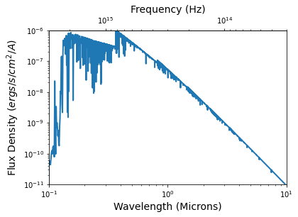

# _Python for Scientific Data Analysis_

## Homework - Week 9 (due November 1)

### 1. Project Update

* Please give me a **short** update on the progress of your class project.  In particular, I would like to see ...

- A description of the current status of your project
- Items where you are getting stuck (if any)/questions you may have
- Any plots or graphics you have produced beyond those from last week's homework.


### 2. Axis Formatting

 Start with the data arrays shown in Ex2_2a along with their polynomial fits:
 
 ```
 xarray=np.arange(20)   #an array of numbers from 0 to 19
 yarray=np.arange(20)+3*np.random.randn(20)
 #y is same as x EXCEPT now we vary the value +/- some random number about x

 a,b=np.polyfit(xarray,yarray,1)

 yarray2=(np.arange(20))**2.+20*np.random.randn(20)

 #polynomial of degree two
 a2,b2,c2=np.polyfit(xarray,yarray2,2)

 poly=np.poly1d(np.polyfit(xarray,yarray2,2))
 #a convenience class to write the polynomial fit
 
 ```
 
 Just to be clear, this produces the following plot:
 
 
 
 **NOW ...**
 
 **Adjust this plot** using information from the Axis Limits, Scaling, and Formatting section and elsewhere to produce the following modified plot:
 
 
 
 
 Note the following things:
 
 * the axis labeling formats
 * scalings (linear or logarithmic)
 * spine thickness
 * transparency of the plotted points
 * linestyles
 * symbol sizes
 
 (also note that the exact points and functional fits will differ from mine since they are produced from random number generators)
 
 Don't worry about getting the figure sizes exactly.

### 3. Secondary/Twin Axes

Most stellar spectra are plotted with x units of wavelength (because the numbers go from smaller to larger, left to right).   

Read in the following stellar atmosphere model 'lte9800-3.5-NextGen.fits.gz'.  The native units are wavelength (in microns) and flux density in $ergs/s/cm^{2}/A$.

Plot the x axis in both wavelength and frequency units as follows:

 
 
 
The following piece of code will get you started (note, you will need to install AstroPy for this to work (AstroPy will be discussed in early November)

```
from astropy.io import fits


primary_model=fits.open('./lte9800-3.5.NextGen.fits.gz')
                    
phead=primary_model[0].header
primary_spec=primary_model[0].data

primary_spec.shape
##primary_wvlh=primary_spec[:,0]
#prim

primary_wvlh=primary_spec[0,:]
primary_flux=primary_spec[1,:]
```
