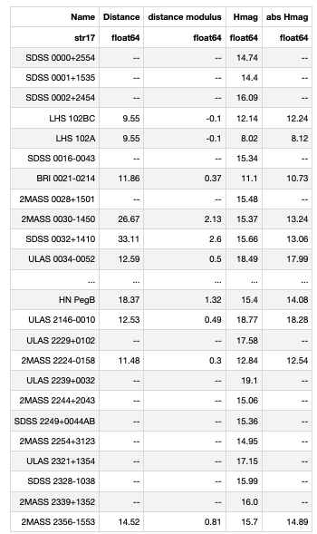
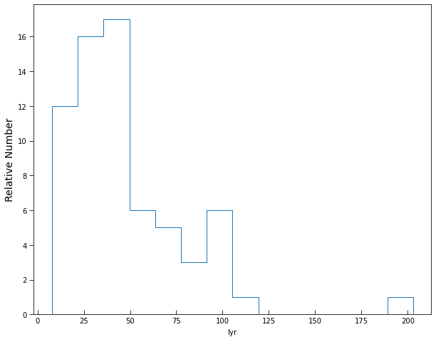

# _Python for Scientific Data Analysis_

## Homework - Week 12 (due November 15)

### 1. Project Update 

* Please give me a **short** update on the progress of your class project.  In particular, I would like to see ...

- A description of the current status of your project
- Items where you are getting stuck (if any)/questions you may have
- Any plots or graphics you have produced beyond those from last week's homework.

### 2. Reading in Fits Files

* read in 'keckimage.fits'
* save the image array as a variable, save the header as a variable
* from the header, return the keyword values for the altitude and azimuth of the telescope during this exposure
* use i) a NumPy function call to return a value for the dimensions of the image and ii) an astropy function call to return a value for the dimensions of the image

### 3. Reading in Fits Files

* read in the data cube `adi_oct172021.fits'
* return the keyword value for aperture radius in the third slice (here the first slice is indexed as 0)
* compute the pixel value of the cube at for the 10th slice (indexed from 0) at x=82, y=79.  
* What are the flux density units of the cube?

### 4. Writing Fits Files
* take the median of 'adi_oct172021.fits' across all wavelengths
* save as a new fits file called 'median_adi_oct172021.fits' with the previous fits header information retained.

### 5. (grad students only) Animations

Start with the animation ex1_6.gif. 

 Edit the source code to create a gif or a movie that prints a) a label at the top-left saying ``Exoplanet HIP 99770 b`` on the top line and ``SCExAO/CHARIS`` on teh second line and a counter at the bottom-left reading ``Wavelength Slice [Number]`` where the number increments by 1 with each slice.  See the attached file ``problem3.mp4`` for an example.
 
 Hints:
 
 * with each frame in the animation the original source code in my notes appends ``im`` which is an ``axes.imshow`` call (i.e. appends an image frame).   To get markups added, you also need to append them with each loop.
 
 * think carefully about _where_ you add the wavelength labeling in your source code.

 
### 6. AstroPy Tables

* read in the file ``leggett.txt`` (data for brown dwafs from my colleague at the Gemini Observatory, Sandy Leggett).

* what is the format type for this table? (basic, latex, mrt, csv, or ipac)

* one of the columns is the **negative** of the distance modulus ``M-m``: ``-5*log10(distance/10)``, where distance is in parsecs.  The others are self-explanatory

Create a new table in the LaTeX format called ``newleggett.tex`` with the columns 'Name', 'Distance', 'H mag', and 'abs Hmag'.   Here 'distance', should be the distance in parsecs (you can figure out out from the distance modulus) and 'abs Hmag' is the absolute H band magnitude (i.e. absolute magnitude = apparent magnitude - distance modulus).

* read your newly-created table back in to confirm that you have formatted the table properly.  If you do this in Jupyter Notebooks, the new table should be displayed as follows:

### 7. Units

* take the result from ``newleggett.tex``.  Read in this file using ``ascii.read``, extract the column for Distance in units of parsecs.
* use ``units`` to give explicit units of parsecs to these distances.  
* using ``units``, convert these distances to light-years (abbreviated ``lyr``).
* Do a simple histogram plot following the format of our galaxy velocity dispersion example:

