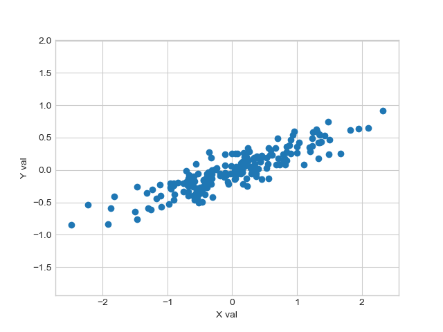
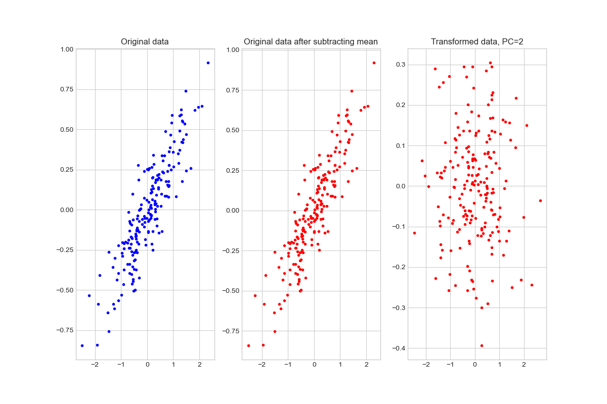

# _Python for Scientific Data Analysis_

## Homework - Week 4 (continuing from Week 3)

### 7. Eigendecomposition (in class)

- construct a 3x3 matrix with elements

 ```
       [40, 42.5, 45, 47.5, 50, 52.5, 55, 57.5, 60 ]
 ```
 
 using the ``np.linspace`` and ``reshape`` functions.
 
 - perform eigendecomposition on this matrix.

  - what is the rank of the original matrix?   Why is the answer not 3?

 
### 8. Eigendecomposition (graduate students only)

- construct a 3x3 matrix with elements 

```
[16, 18.0625, 20.25,22.5625, 25, 27.5625, 30.25, 33.0625, 36]

```

using the ``np.linspace`` and ``reshape`` functions (hint: 4$^{2}$=16, 5$^{2}$=25, and 6$^{2}$=36).

 - confirm the formulas  $\textbf{A}$ = $\textbf{V}\Lambda\textbf{V}^{-1}$ and $\Lambda$= $\textbf{V}^{-1}\textbf{A}\textbf{V}$ using this matrix as $\textbf{A}$.


### 9. PCA (in class?)

- Take the data shown in our first plot of the PCA lecture notes:
```
rng = np.random.RandomState(1)
X = np.dot(rng.rand(2, 2), rng.randn(2, 200)).T
```




Perform PCA on these data to produce the following plot:




- Do the same analysis but now use only 1 principal component.

Use the source code in ``pcademo3.py`` for plotting and guidance.  