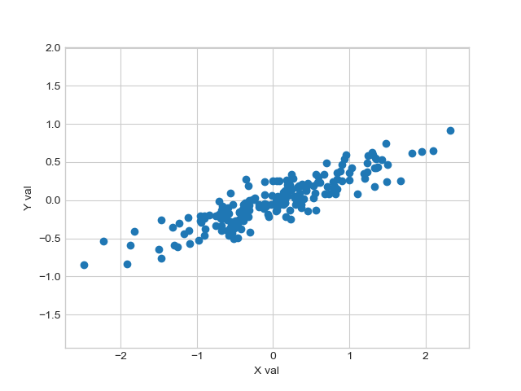
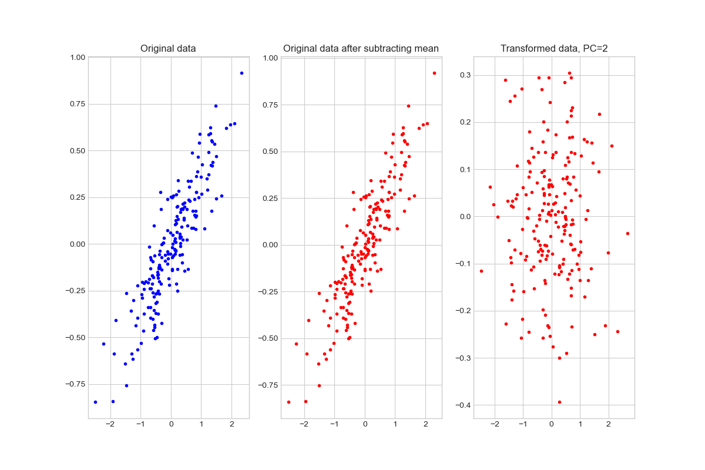

# _Python for Scientific Data Analysis_

## Homework - Week 5 


### 1. PCA (in class)

- Take the data shown in our first plot of the PCA lecture notes:
```
rng = np.random.RandomState(1)
X = np.dot(rng.rand(2, 2), rng.randn(2, 200)).T
```




Perform PCA on these data to produce the following plot:




- Do the same analysis but now use only 1 principal component.

Use the source code in ``pcademo3.py`` for plotting and guidance. 


### 1. PCA and SVD (in class) 

Part 1

- Create an array of random numbers with dimensions (7,3) ...

- perform PCA on this array (remember all of the steps to PCA).  

To produce a (3,3) covariance matrix, I recommend you do ``np.matmul(array.T,array)`` where "array" is your mean-subtracted array.  

- starting with the _mean\_subtracted_ version of the above array, perform SVD
-  Compare the eigenvectors computed from PCA to the matrices computed from SVD.  Are there any similarities?
-  Compare the eigenvalues computed from PCA to the singular values computed from SVD.   Are there any similarities (hint: how does the square of all numbers in one array compare to another array)

Part 2
- Repeat part 1 except for a random (9,3) array.   


What conclusions can you draw about PCA vs SVD from these results?


