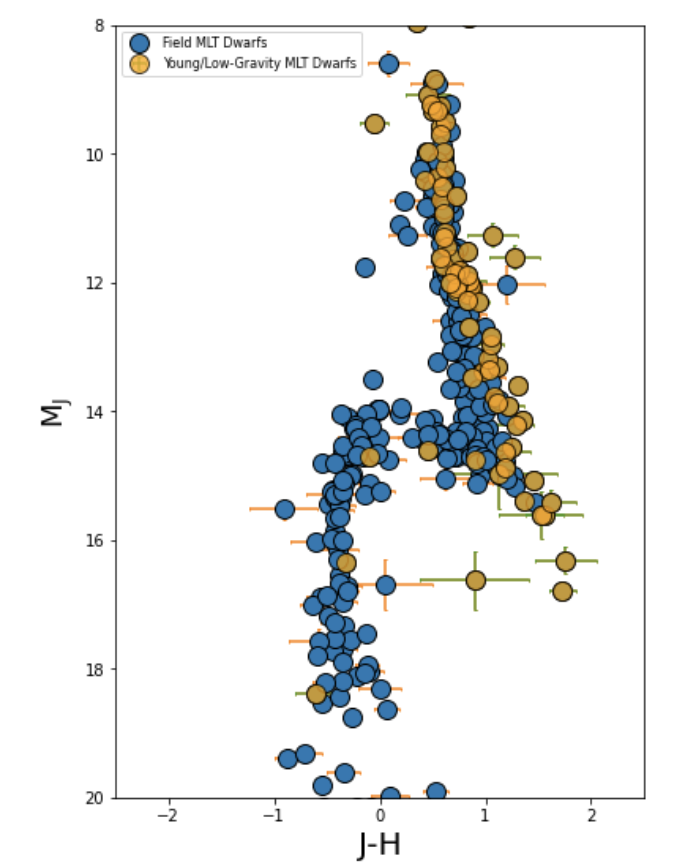

# _Python for Scientific Data Analysis_

## Homework - Week 8


### 1. Goodness-of-Fit, $\chi_{}^{2}$


Consider ...

 * a model with two free parameters fit to 115 data points, yielding a $\chi^{2}$ statistic of 127.
 * a model with one free parameter fit to 15 data points with a  $\chi^{2}$ statistic of 26.

 
 - Compute the $p$ values for both model fits.
 - Which models are consistent with the data at the 1-$\sigma$ confidence limit?  At 3-$\sigma$?

### 2. Goodness-of-Fit, $\chi_{\nu}^{2}$

See the attached figure panel comparing the spectrum of a brown dwarf to a library of other substellar objects.   Assume that each model fit loses one degree of freedom. 

- Compute the $\chi^{2}$ values for the three model fits.
- Compute the $p$ values for the three model fits.  


### 3. Student's t-distribution

Use the ``def tpenalty`` function as a starting point ...

* Assume that you are computing a contrast curve with an instrument that uses only half of the field of view. 

* What is the contrast penalty at a distance of 2.5 $\lambda$/D from the star?


### 4. Simple Matplotlib Plotting

* read in ``file.txt``
* use SciPy's ``curve_fit`` function
* plot the best-fit function as an orange dash-dotted line
* overplot the original data with green cross symbols
* Label ``X`` and ``Y`` in size 14 font.

### 5. Customized Matplotlib Plotting

* read in ``compilation.txt`` 
* reproduce the following plot




* note: the array slicing is a little bit tricky (ideally you want a vectorized string operation with wildcards).  Here's a simple version:

```
lowg=np.where( ( flag == 'lowg') | (flag == 'young') | (flag == 'lowg,young') | (flag == 'ABDor,lowg,young')
              | (flag == 'Argus,lowg,young') | (flag == 'Columba,lowg,young') | (flag == 'TWA,lowg,young')
              | (flag == 'ScoCen,young')                                 
              | (flag == 'TucHor,young') | (flag=='Tuc-Hor,lowg,young') | (flag == 'plx-discrep,lowg') )
```

* note: the problem will require you to inspect the file to see the column headers.